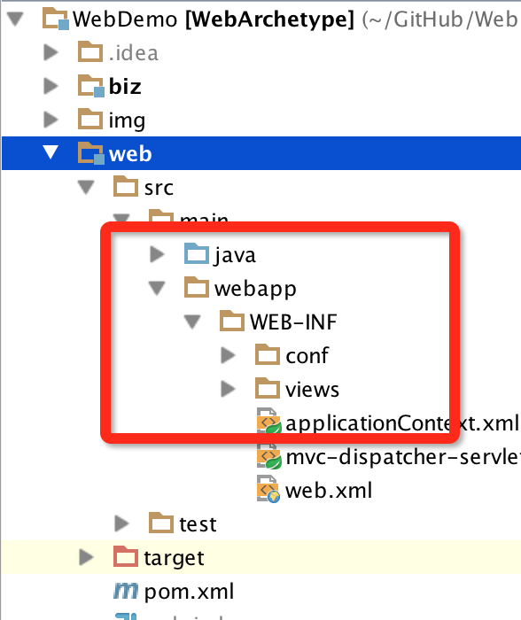
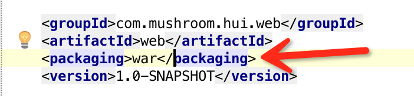

WebDemo
===
> a java project base on Spring 

Struct
===
### 1. biz

具体的业务代码工程

### 2. web

web层代码工程

### 3. common

为通用的数据接口，如返回

Q&A
===
### 1. IDEA中webapp目录一直为普通文件夹的格式

 

**解决方法:**

主要是web工程下面的pom.xml没有指定packing, 加上即可

### 2. 返回页面时，一直都是空白

这个问题比较2了，主要是 布局文件 `layouts/none.vm`出了问题

none.vm 的内容并非是空的，而是`$screen_content` 有这么一行